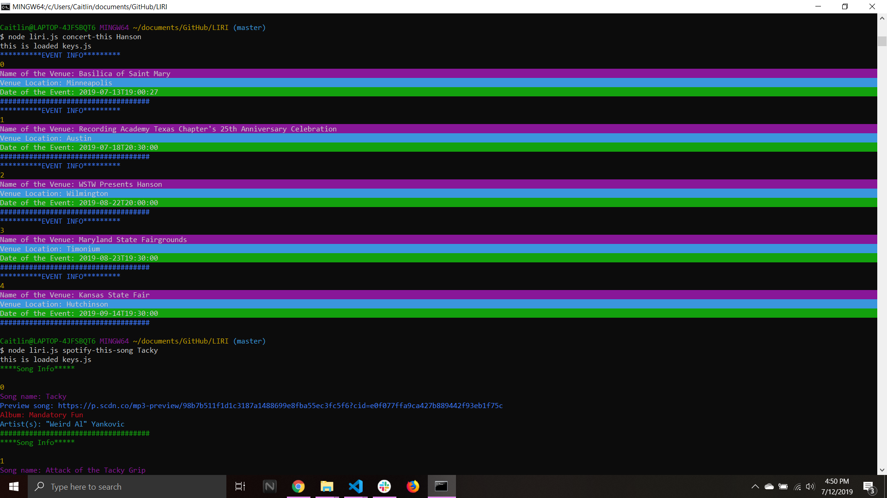
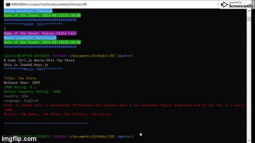
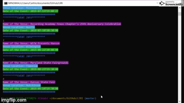
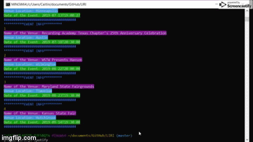

# LIRI
### A Language Interpretation and Recognition Interface. This javaScript program, designed to run in node, is made to take in various user inputs and then provide information related to the query.

<h2>Set up</h2>
<h5>In order to run this application you will need to run the npm install command, in the file destination in console log. This should install the npm mySql and the npm Inquirer.

To run the customer interface please follow the steps below: </h5>

* clone into the repo using this link: https://github.com/Cmoconnor0823/LIRI.git
* cd liri
* npm install
* node liri.js

# How It Works:
### Before running app, make sure to run NPM Install to load in needed Modules
### - If Install doesn't work you'll have to manually install fs, request, node-spotify-api and chalk before it will run correctly.

### Now you may choose which search you would like to begin by inputing one of the following commands into the command line,

<h4>
- ***node liri.js spotify-this-song "song name here"*** to return song information from Spotify. If no song is entered, The Sign by Ace of Base will be returned.
  
- ***node liri.js concert-this "artist/band name here"*** to return concert information from Bandsintown. 
  
- ***node liri.js movie-this "movie name here"*** to return movie information from OMDb. If no movie is entered, a reccomendation for a movie will be displayed.
  
- ***node liri.js do-what-it-says*** to return a set of random Queries --- this is the information stored in random.txt
</h4>

# Liri Demo

 

 

 

 

*** to see a live demo of the app please view the link below ***
https://drive.google.com/file/d/1WBg9dmy4piIiPOakDZdbhRm-EM5RI18z/view

This page was built with the following technologies, NPM Modules, and API's:

[Node.js](https://nodejs.org/en/)

[fs](https://www.npmjs.com/package/fs)

[request](https://www.npmjs.com/package/request)

[spotify-npm] (https://www.npmjs.com/package/node-spotify-api)

***optional styling done with [chalk](https://www.npmjs.com/package/chalk) ***

[Bandsintown API](http://www.artists.bandsintown.com/bandsintown-api)

[OMDb API](http://www.omdbapi.com/)

[Spotify API](https://developer.spotify.com/documentation/web-api/)

* [Git Bash](https://gitforwindows.org/)

* [Visual Studio Code](https://code.visualstudio.com/)

* [JavaScript](https://developer.mozilla.org/en-US/docs/Web/JavaScript/Reference)

For comments/ concerns contact the project 
* Author: Caitlin O'Connor  
* At: Cmoconnor0823@gmail.com
